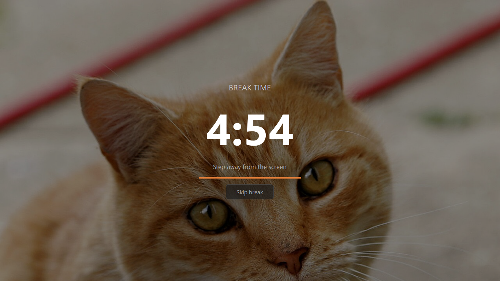

# 🐱 Cat Gatekeeper — Focus Timer with Full-Screen Cat Break Enforcer

<div align="center">


### A modern productivity timer that forces healthy breaks using adorable full-screen cat interruptions.

</div>

---

# 📌 Overview

**Cat Gatekeeper** is a desktop productivity application built using **Python** and **PyQt5**.

It helps users stay productive during focused work sessions while enforcing proper breaks through a full-screen immersive cat overlay system.

Once the work timer ends, the application launches a full-screen break mode displaying random cat images and wellness reminders, encouraging users to step away from the screen and rest properly.

---

# ✨ Features

## ⏳ Productivity Timer
- Adjustable work duration
- Adjustable break duration
- Animated circular countdown timer
- Real-time progress updates

---

## 🐈 Full-Screen Cat Break Overlay
- Displays random real cat photos
- Full-screen immersive overlay
- Motivational break reminders
- Prevents ignoring break time

---

## 🎨 Modern Desktop UI
- Minimal dark-mode design
- Frameless floating window
- Smooth animations
- Professional clean appearance

---

## ⚡ Smart Session Management
- Start / Pause / Reset controls
- Automatic break handling
- Session completion tracking
- Dynamic status updates

---

## 🌐 Online Cat Image Loader
- Fetches cat images dynamically
- Background threaded image loading
- Randomized experience every session

---

# 🖼️ Screenshots

## Main Interface

```text
assets/main-ui.png
```


---

## Focus Session Running

```text
assets/focus-session.png
```


---

## Full-Screen Break Overlay

```text
assets/break-overlay.png
```



---

# 🧠 How It Works

```text
1. Launch the application
2. Set work duration
3. Set break duration
4. Press Start
5. Focus on your task
6. Timer reaches zero
7. Full-screen cat overlay appears
8. Break timer starts automatically
9. Return refreshed
```

---

# 🛠️ Tech Stack

| Technology | Purpose |
|---|---|
| Python | Core application logic |
| PyQt5 | Desktop GUI framework |
| QTimer | Timer countdown system |
| QPainter | Circular timer rendering |
| QThread | Background threading |
| urllib | Online image downloading |

---

# 📂 Project Structure

```bash
Cat-Gatekeeper/
│
├── cat_gatekeeper.py
├── README.md
├── install_and_run.bat
├── run.bat
├── requirements.txt
│

```

---

# 🚀 Installation

## 1️⃣ Clone Repository

```bash
git clone https://github.com/yourusername/cat-gatekeeper.git
cd cat-gatekeeper
```

---

## 2️⃣ Install Dependencies

```bash
pip install PyQt5
```

Or:

```bash
pip install -r requirements.txt
```

---

## 3️⃣ Run The Application

```bash
python cat_gatekeeper.py
```

---

# ⚡ Quick Start For Windows

## First-Time Setup

Double-click:

```bash
install_and_run.bat
```

This automatically:
- Installs required dependencies
- Launches the application

---

## Normal Launch

After installation:

```bash
run.bat
```

---

# 🖥️ Requirements

- Windows 10 or 11
- Python 3.8+
- Internet connection
- PyQt5

---

# 🧩 Application Architecture

## `CatLoader`

Handles asynchronous downloading of cat images from online sources.

### Responsibilities
- Image downloading
- Background loading
- Network handling
- Safe threaded execution

---

## `RingTimer`

Custom animated circular timer widget built using `QPainter`.

### Responsibilities
- Countdown visualization
- Circular progress rendering
- Timer display updates

---

## `TimerWindow`

Main productivity interface.

### Responsibilities
- Timer controls
- Session management
- Progress updates
- Main UI rendering

---

## `OverlayWindow`

Full-screen break overlay system.

### Responsibilities
- Full-screen rendering
- Break countdown
- Cat image display
- Wellness reminders

---

## `App`

Main application manager.

### Responsibilities
- QApplication initialization
- Window management
- Overlay handling
- Signal management

---

# 📸 Screenshot Setup

Create an `assets/` folder in the root directory:

```bash
assets/
├── main-ui.png
├── focus-session.png
└── break-overlay.png
```

Recommended screenshot resolution:

```text
1920x1080
```

---

# 🔥 Key Highlights

- Lightweight desktop application
- Beautiful modern interface
- Smooth animations
- Async image loading
- Responsive timer system
- Fun productivity workflow
- Real-time session tracking

---

# 📈 Future Improvements

- Pomodoro presets
- Productivity analytics
- Statistics dashboard
- Sound effects
- System tray support
- Multi-monitor support
- Offline cat image packs
- Linux & macOS support

---

# 🤝 Contributing

Contributions are welcome.

## Steps

```text
1. Fork repository
2. Create feature branch
3. Commit changes
4. Push branch
5. Open pull request
```

---

# 📜 License

This project is licensed under the MIT License.

---

# 👨‍💻 Author

Built with ❤️ using Python and PyQt5.

---

<div align="center">

# 🐾 The cat demands your break.

</div>
